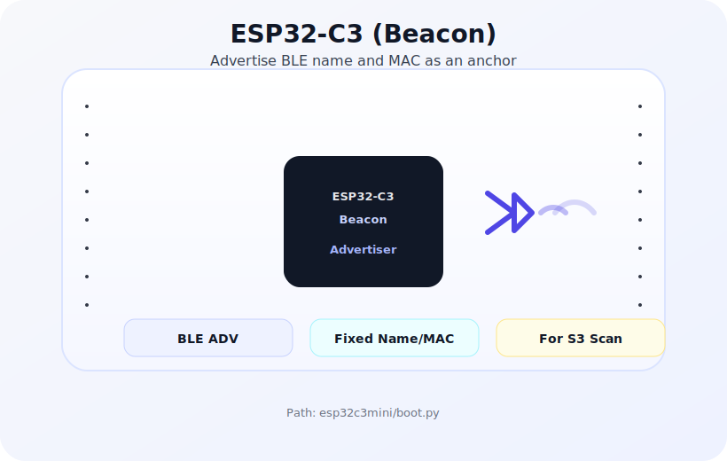
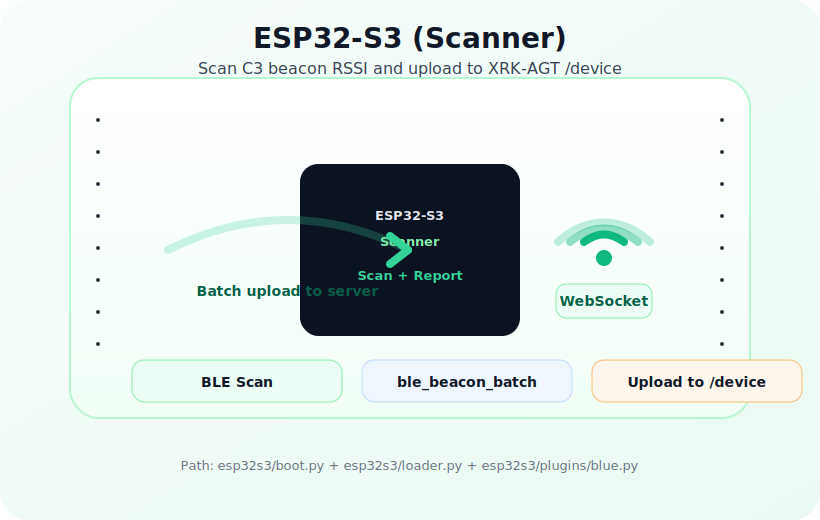

<h1 align="center">IM-SYAU-ble-esp-mcpy-loader</h1>

<p align="center">
  ESP32 MicroPython 采集端：BLE 信标（C3）广播 + 扫描器（S3）上报到 XRK-AGT（/device），供 IM-SYAU-Core 聚合与展示
</p>

<p align="center">
  关联项目：
  <a href="https://github.com/sunflowermm/IM-SYAU-Core">IM-SYAU-Core</a>
</p>

<p align="center">
  
  
</p>

<p align="center">
  ESP32-C3（信标广播） · ESP32-S3（扫描上报）
</p>

---

## 与 IM-SYAU-Core 的关系

```mermaid
graph LR
  subgraph Device["ESP32 设备侧（本仓库）"]
    S3[ESP32-S3\n扫描/上报]
    C3[ESP32-C3\n广播(信标)]
  end

  subgraph Server["XRK-AGT 服务端"]
    WS["system-Core\nWebSocket /device"]
    BLE["IM-SYAU-Core\n蓝牙插件/HTTP API"]
    DB[(data/blues/ble_data.json)]
  end

  C3 -->|BLE 广播| S3
  S3 -->|type=data,data_type=ble_beacon_batch| WS
  WS -->|device.ble_beacon_batch 事件| BLE
  BLE --> DB
```

---

## 目录结构

```
IM-SYAU-ble-esp-mcpy-loader/
├── README.md
├── LICENSE
├── esp32s3/
│   ├── boot.py            # 启动入口：检测配网/正常模式
│   ├── loader.py          # 设备加载器：WiFi + WS + 插件系统
│   ├── plugins/
│   │   ├── blue.py        # BLE 扫描并上报 ble_beacon_batch
│   │   └── base/plugin.py # 插件基类
│   └── lib/               # 依赖库（随项目上传到设备）
└── esp32c3mini/
    └── boot.py            # C3 广播脚本（模拟/固定信标）
```

---

## ESP32-S3：连接与上报

- **WebSocket 地址**：`ws://<server_host>:<server_port>/device`
- **注册**：启动后发送 `type=register`（包含 `device_id/device_type/device_name/...`）
- **数据上报**：插件通过 `loader.send_data()` 发送 `type=data` 的消息

### 上报数据协议（关键字段）

`esp32s3/plugins/blue.py` 会调用：

- `send_data('ble_beacon_batch', report)`

`report` 结构（示例字段）：

```json
{
  "timestamp": 1730000000,
  "batch": 1,
  "total_batches": 1,
  "update_interval": 2,
  "beacons": [
    {
      "mac": "AA:BB:CC:DD:EE:FF",
      "name": "ESP-C3-001",
      "online": true,
      "rssi": { "current": -58.2, "average": -58.2, "samples": 5 },
      "last_seen": 0,
      "sample_count": 123
    }
  ]
}
```

服务端（XRK-AGT）会把 `type=data,data_type=ble_beacon_batch` 转成事件：

- `device.ble_beacon_batch`（细分事件，`event_data = report`）

`IM-SYAU-Core` 的蓝牙插件监听 `device.ble_beacon_batch` 并写入 `data/blues/ble_data.json`，供前端 `/kb` 与 `/api/ble/*` 查询展示。

---

## 插件加载（默认启用所有插件）

`esp32s3/loader.py` 的插件加载逻辑：

- 当 **未配置** `enabled_plugins`（或为空）时，会扫描 `plugin_dir`（默认 `/plugins`）并 **默认启用目录下所有可用插件**（排除 `_` 前缀与 `base*`）。
- 若你希望只启用部分插件，可在设备配置里显式设置 `enabled_plugins`（例如 `["blue"]`）。

---

## 许可证

本仓库采用 [MIT License](LICENSE)。与配套项目 [`IM-SYAU-Core`](https://github.com/sunflowermm/IM-SYAU-Core) 一起作为同一套“昆虫博物馆智能导览”解决方案的组成部分。

